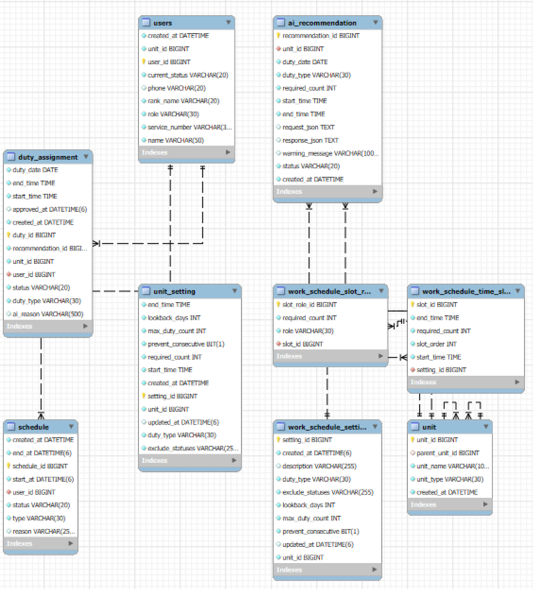
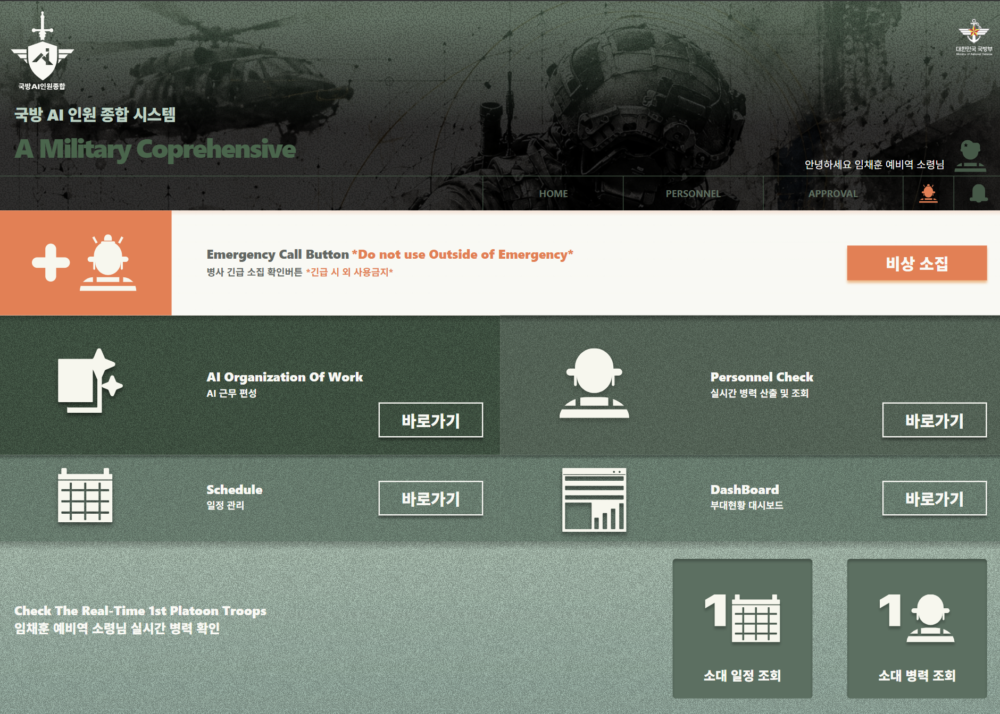
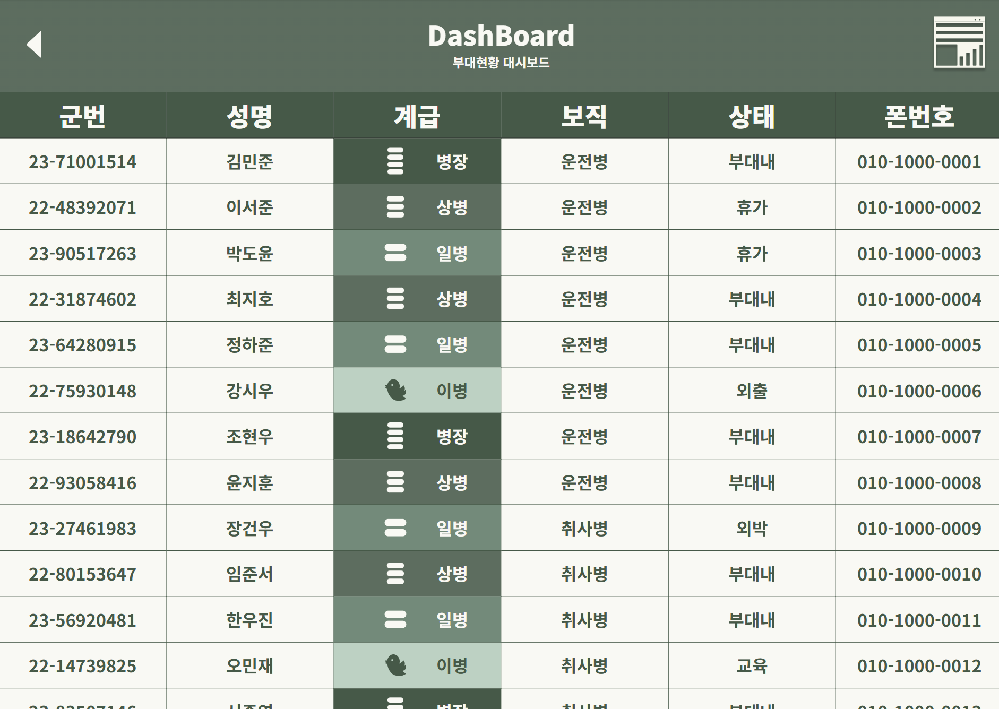
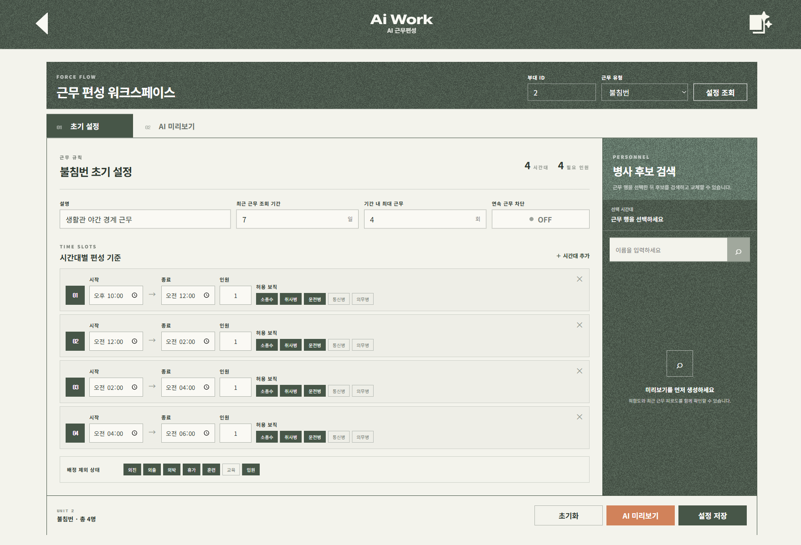
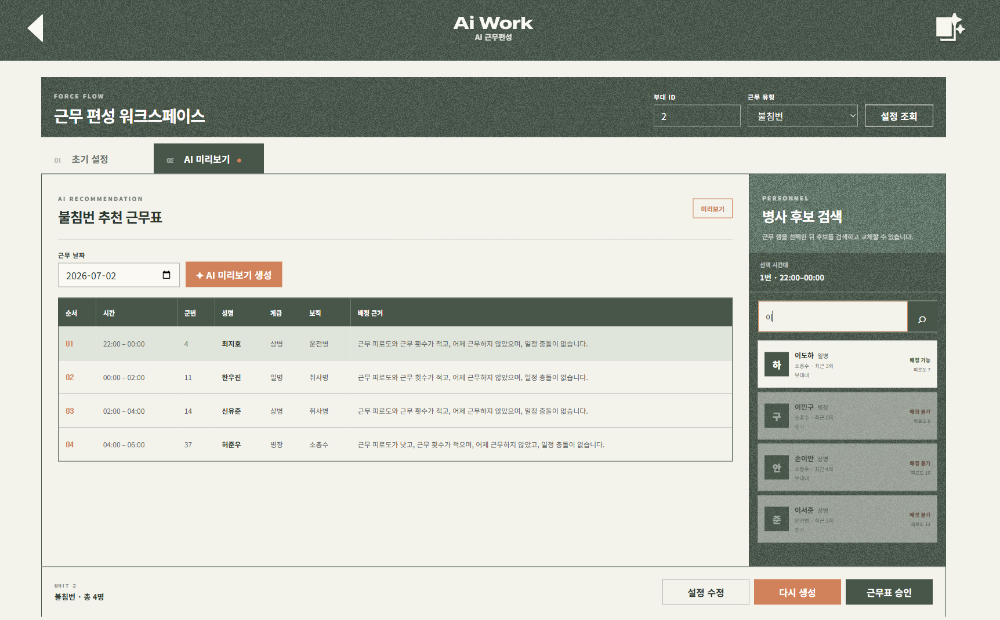
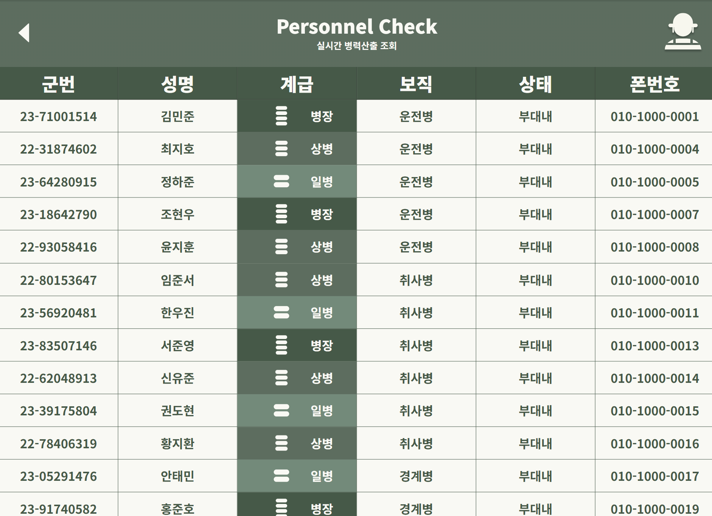

# ForceFlow

> **AI 기반 군 병력 및 근무 관리 시스템**

ForceFlow는 부대 내 병력 관리, 일정 관리, 근무 편성을 하나의 시스템으로 통합하고,
AI를 활용하여 공정한 근무 추천을 제공하는 군 전용 관리 플랫폼입니다.

---

## 🔗 Demo

### Frontend

https://force-flow-frontend.vercel.app/

---

## 🛠 Tech Stack

### Backend

| 항목 | 내용 |
|---|---|
| Language | Java 21 |
| Framework | Spring Boot 4.1.0 |
| ORM | Spring Data JPA / Hibernate |
| Database | MySQL |
| Build | Gradle |
| Deploy | Railway |

### Frontend

| 항목 | 내용 |
|---|---|
| Framework | React |
| Styling | CSS |
| Deploy | Vercel |

### AI

| 항목 | 내용 |
|---|---|
| API | OpenAI API |
| 활용 | 근무 후보 병사 공정 추천 |

---

## 🗄 ERD

<p align="center">
  
</p>

### 주요 테이블

| 테이블 | 설명 |
|---|---|
| `unit` | 부대 (대대 → 중대 → 소대 → 분대 계층 구조) |
| `users` | 병사 정보 (계급, 역할, 현재 상태) |
| `unit_setting` | 부대별 근무 기본 설정 |
| `schedule` | 병사 개인 일정 (훈련, 교육 등) |
| `work_schedule_setting` | 근무 종류별 슬롯 설정 |
| `work_schedule_time_slot` | 시간대별 슬롯 (초번 분할) |
| `ai_recommendation` | AI 추천 기록 |
| `duty_assignment` | 확정 근무 배정 |

---

## ✨ 주요 기능

### 👨‍✈️ 병사 관리

- 병사 등록 / 조회
- 현재 상태 변경 (`부대내`, `휴가`, `외출`, `외박`, `교육`, `훈련`, `입원`, `외진`)

### 📅 일정 관리

- 병사 개인 일정 등록 / 조회
- 일정 충돌 자동 감지 (근무 배정 시 반영)

### ⚙️ 근무 설정

- 근무 종류별 시간대 슬롯 설정 (불침번, 위병소 근무 등)
- 슬롯별 필요 인원 및 허용 역할 설정
- 제외 상태 설정
- 최근 근무 조회 기간 설정 (`lookbackDays`)
- 연속 근무 방지 설정 (`preventConsecutive`)
- 최대 근무 횟수 제한 (`maxDutyCount`)

### 🤖 AI 근무 추천

- 슬롯 설정 기반 근무 가능 병사 자동 필터링
- OpenAI를 이용한 공정 근무 추천 생성
- 피로도 점수 기반 공정성 보장
- 추천 미리보기 → 병사 수정 → 승인 확정 플로우

---

## 📐 AI 공정성 알고리즘

근무 추천 시 `recentDutyCount` (최근 근무 횟수)와 `recentDutyFatigueScore` (피로도 점수)를 함께 고려합니다.

### 피로도 점수 기준

| 시간대 | 점수 |
|---|---|
| 00:00 ~ 06:00 포함 | 4점 |
| 22:00 ~ 24:00 포함 | 3점 |
| 18:00 ~ 22:00 포함 | 2점 |
| 그 외 주간 | 1점 |

- 피로도 점수가 낮은 병사를 우선 추천합니다.
- 같은 시간대(슬롯)에 이병은 최대 1명만 배정됩니다.
- Entity 추가 없이 기존 확정 근무 이력의 `startTime`, `endTime` 기준으로 계산합니다.

---

## 📱 UI

### 메인 화면

<p align="center">
  
</p>

### 대시보드

<p align="center">
  
</p>

### AI 근무편성 초기설정

<p align="center">
  
</p>

### AI 근무편성 추천 미리보기

<p align="center">
  
</p>


### 가용 가능 인원 자동 조회

<p align="center">
  
</p>

---

## 📂 Project Structure

```text
src/main/java/ForceFlow/Military
├── unit/                    # 부대 관리
│   ├── UnitController.java
│   ├── UnitService.java
│   ├── UnitSettingController.java
│   └── UnitSettingService.java
├── user/                    # 병사 관리
│   ├── UserController.java
│   ├── UserService.java
│   ├── UserStatusService.java
│   ├── AvailableUserController.java
│   └── DutyCandidateController.java
├── schedule/                # 일정 관리
│   ├── ScheduleController.java
│   └── ScheduleService.java
├── workSchedule/            # 근무표 관리 (AI 추천 포함)
│   ├── controller/
│   │   ├── AiRecommendationController.java
│   │   ├── WorkScheduleUnitSettingController.java
│   │   └── WorkScheduleExceptionHandler.java
│   ├── dto/
│   └── constant/
├── service/                 # 공통 서비스
│   ├── DutyCandidateQueryService.java
│   └── DutyCandidateQueryServiceImpl.java
├── entity/                  # JPA 엔티티
│   ├── Unit.java
│   ├── User.java
│   ├── UnitSetting.java
│   ├── Schedule.java
│   ├── AiRecommendation.java
│   └── DutyAssignment.java
├── repository/              # JPA 레포지토리
└── dto/                     # 공통 DTO
    ├── requestDto/
    └── responseDto/
```

---

## 🔄 Service Flow

```text
근무 설정 저장 (PUT /api/work-schedules/units/{unitId}/setting)
      │
      ▼
AI 미리보기 요청 (POST /api/work-schedules/preview)
      │  └─ 부대 하위 병사 전체 조회
      │  └─ 피로도 점수 / 근무 횟수 계산
      │  └─ OpenAI 추천 생성
      │  └─ ai_recommendation 기록 저장
      ▼
미리보기 확인 및 병사 수정 (필요 시 GET /api/work-schedules/candidates 로 후보 검색)
      │
      ▼
승인 확정 (POST /api/work-schedules/confirm)
      │  └─ 역할 / 슬롯 / 중복 / 연속 근무 / 이병 제한 검증
      │  └─ duty_assignment 저장
      ▼
날짜별 근무표 조회 (GET /api/work-schedules)
```

---

## 🌐 API 목록

| Method | Endpoint | 설명 |
|---|---|---|
| `PUT` | `/api/work-schedules/units/{unitId}/setting` | 부대 근무 초기설정 저장 |
| `GET` | `/api/work-schedules/units/{unitId}/setting` | 부대 근무 초기설정 조회 |
| `POST` | `/api/work-schedules/preview` | AI 근무 추천 미리보기 생성 |
| `POST` | `/api/work-schedules/confirm` | 미리보기 승인 확정 |
| `GET` | `/api/work-schedules/candidates` | 근무 후보 병사 검색 |
| `GET` | `/api/work-schedules` | 날짜별 확정 근무표 조회 |

> 상세 API 명세는 [`src/main/java/ForceFlow/Military/workSchedule/WORK_SCHEDULE_API_SPEC.md`](src/main/java/ForceFlow/Military/workSchedule/WORK_SCHEDULE_API_SPEC.md) 참고

---

## 🚀 실행 방법

### 1. 저장소 클론

```bash
git clone https://github.com/Hackathon-Force-Flow/ForceFlow-Backend.git
cd ForceFlow-Backend
```

### 2. 환경 변수 설정

`application.properties` 또는 `.env` 파일에 아래 항목을 설정합니다.

```properties
spring.datasource.url=jdbc:mysql://localhost:3306/military_db
spring.datasource.username=your_username
spring.datasource.password=your_password
OPENAI_API_KEY=your_openai_api_key
```

### 3. 서버 실행

```bash
./gradlew bootRun
```

서버 기본 주소: `http://localhost:8080`

---

## 📄 License

This project was developed for educational and hackathon purposes.